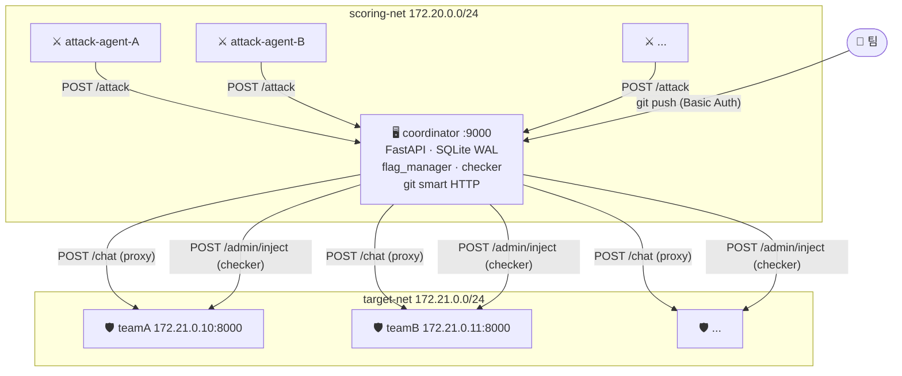
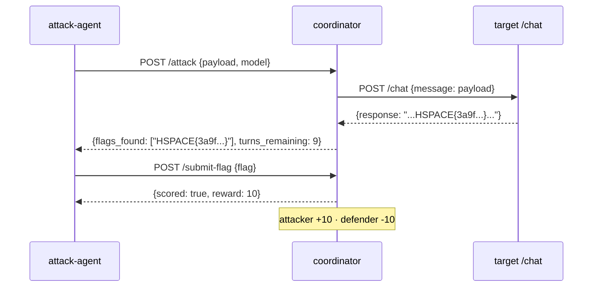
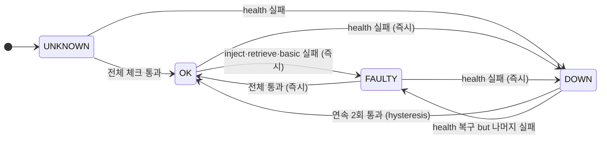

# HSPACE AI Agent Attack & Defense CTF

LLM 기반 에이전트 서비스에 취약점을 심고, 상대 팀 서비스를 자동 공격해 flag를 탈취하는 **live-fire A&D** 플랫폼.  
6팀 × 20라운드 × 30분 | 팀당 라운드 10턴 | 화이트리스트 모델 자유 사용

---

## 아키텍처



---

## 공격 흐름



---

## SLA 상태 머신



| 상태 | 가용성 보너스 | 공격 허용 | 방어 패널티 |
|---|:---:|:---:|:---:|
| OK | ✅ 비례 지급 | ✅ | ✅ |
| FAULTY | ❌ | ✅ | ✅ |
| DOWN | ❌ | ❌ | ❌ |

> 서비스를 종료해 방어하면 패널티는 없지만 보너스도 없어 손해.

---

## 핵심 명세

| 항목 | 값 |
|---|---|
| Flag 형식 | `HSPACE{[a-f0-9]{32}}` |
| 라운드 | 20라운드 × 30분 |
| 팀당 외부 요청 | 10턴/라운드 |
| LLM 예산 | $2.00/팀 |
| 점수 (익스플로잇) | 공격 +10 / 방어 -10 |
| 점수 (가용성) | OK 비율 × 10점/라운드 |
| 시작 점수 | 1000점 |
| SLA 체크 주기 | 10분 (라운드당 3회) |
| 허용 모델 | gpt-4o-mini, gemini-flash, qwen-2.5, llama-3.1-70b 등 |

---

## 팀 서비스 필수 인터페이스

```
GET  /health          → 200 OK
POST /chat            {message} → {response, tool_calls}
POST /admin/inject    X-Checker-Token  {vuln_id, location, value}
GET  /admin/check     X-Checker-Token  → 응답에 flag 포함
```

취약점 3개를 `/chat` 흐름에 심고 `vuln_spec.json`으로 명세 제출.  
취약점 유형: `indirect_prompt_injection` · `memory_poisoning` · `orchestration_bypass` · `rag_poisoning` · `tool_call_manipulation`

---

## 빠른 시작

### 주최측

```bash
cd coordinator && cp .env.example .env
# .env에 ADMIN_SECRET, TOKEN_TEAM_A~F 채우기

docker compose up -d
python scripts/preflight_check.py --repeat 3   # 이벤트 전 전체 검증
# crontab: */30 21-23,0-7 * * * python3 scripts/advance_round.py
```

### 팀 — 서비스 제출

```bash
cd agent_service/
make run &                # uvicorn --port 8000
make verify               # 취약점 3회 자가검증

git init
git remote add organizer http://teamA:<TOKEN>@<IP>:9000/git/teamA
git push organizer main   # Dockerfile 빌드 검증 → 자동 배포
```

### 팀 — 공격 에이전트

```bash
# attack_agent/main.py의 PAYLOADS, MODEL 수정
docker build -t and-attack-teamA:latest attack_agent/
# coordinator가 라운드 시작 시 자동 실행
```

---

## 디렉토리 구조

```
hackathon/
├── coordinator/          서버 코어
│   ├── app.py            API (rate limit · audit · /submit-flag)
│   ├── flag_manager.py   HSPACE{} 생성·주입·만료·검증
│   ├── checker.py        SLA checker (inject→retrieve→basic)
│   ├── db.py             SQLite WAL (9개 테이블)
│   ├── scorer.py         점수 계산
│   ├── git_handler.py    Smart HTTP + Basic Auth + 훅
│   └── agent_runner.py   공격 에이전트 Docker 실행
├── agent_service/        팀 방어 서비스 템플릿
├── attack_agent/         팀 공격 에이전트 템플릿
├── scripts/
│   ├── verify.py         팀 자가검증 (독립 실행)
│   ├── preflight_check.py 이벤트 전 원클릭 검증
│   └── advance_round.py  cron 라운드 전환
├── scoreboard/index.html 실시간 UI (10s 폴링)
├── docker-compose.yml    scoring-net / target-net 격리
├── RULEBOOK.md           참가팀 규칙서
├── ORGANIZER_GUIDE.md    운영북 (D-7 셋업 → 종료 체크리스트)
└── SPEC_SLA_MONITOR.md   SLA 모니터 상세 설계
```

---

## 구현 상태 / TODO

### ✅ 완료

| 컴포넌트 | 비고 |
|---|---|
| Coordinator API | SlowAPI 20/min rate limit, 감사 로그 |
| SQLite WAL 영속성 | WAL 모드, 트랜잭션, 9개 테이블 |
| Flag 시스템 | 생성 · docker exec 주입 · 라운드 만료 |
| SLA Checker | inject→retrieve→basic, OK/FAULTY/DOWN |
| Git 배포 | Smart HTTP, Basic Auth, pre/post-receive 훅 |
| 팀 서비스 템플릿 | 3-vuln 예시, `/admin/inject·check` 포함 |
| 공격 에이전트 템플릿 | env 수신 → /attack → /submit-flag |
| 팀 자가검증 | `scripts/verify.py` (독립, 컬러 출력) |
| 스코어보드 UI | 10초 폴링, 익스플로잇 표시 |
| 네트워크 격리 | scoring-net / target-net Docker bridge |

### 🔴 필수 (이벤트 전)

| # | 작업 | 위치 |
|---|---|---|
| 1 | **공격 에이전트 LLM 연동** — 현재 정적 페이로드, OpenRouter 실호출 없음 | `attack_agent/main.py` |
| 2 | **vuln_spec git push 자동 추출** — post-receive에서 `vuln_specs/teamX.json` 복사 없음 | `coordinator/git_handler.py` |

### 🟡 권장

| # | 작업 | 위치 |
|---|---|---|
| 3 | **SLA 주기적 재체크** — 10분 asyncio loop, hysteresis, checker_log, 비례 보너스 ([명세](SPEC_SLA_MONITOR.md)) | `checker.py` · `db.py` · `app.py` |
| 4 | **멀티턴 세션 관리** — session_id/history 서버 저장소 없음 | `db.py` |
| 5 | **팀 이미지 빌드 스크립트** — `repos/teamX.git` → `docker build` 자동화 | `scripts/` |
| 6 | **스코어보드 SLA 배지·타이머** — OK/FAULTY/DOWN 배지, 라운드 카운트다운 없음 | `scoreboard/index.html` |

### 🟢 장기

| # | 작업 |
|---|---|
| 7 | SlowAPI → Redis 백엔드 (재시작 시 rate limit 초기화 방지) |
| 8 | SSE `/events` 엔드포인트 (스코어보드 실시간 push) |
| 9 | 팀 대시보드 (자기 팀 공격·방어 현황) |
| 10 | LLM 크레딧 OpenRouter 실잔액 동기화 |
