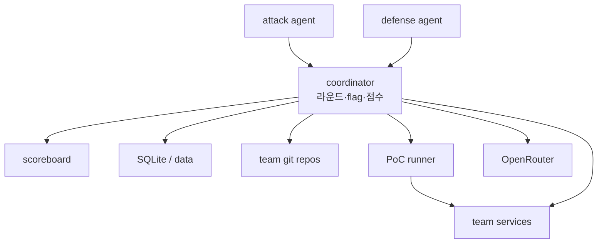
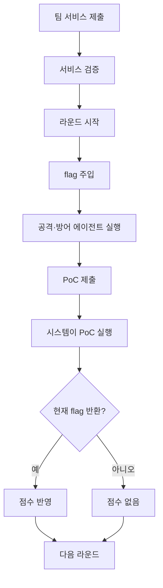
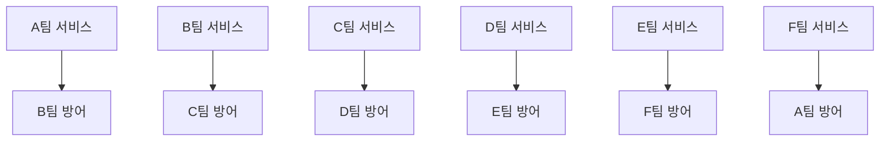

# HSPACE LiveFire AI Agent A&D

AI 에이전트가 웹 서비스를 공격하고 방어하는 Attack & Defense 해커톤 플랫폼입니다.
각 팀은 취약점이 들어 있는 서비스를 제출하고, 공격 에이전트는 다른 팀 서비스에서 flag를 탈취하는 `poc*.py`를 제출합니다. 시스템은 제출된 PoC를 직접 실행해 flag 반환 여부로 점수를 계산합니다.

## 빠른 시작

```bash
cd coordinator
cp .env.example .env
# .env에 ADMIN_SECRET, TOKEN_TEAM_A~F, 필요 시 OPENROUTER_API_KEY 설정

cd ..
docker compose up -d
curl http://localhost:9000/health
```

서비스가 정상이라면 다음 주소를 사용할 수 있습니다.

| 주소 | 용도 |
|---|---|
| `http://localhost:9000` | coordinator API |
| `http://localhost:8080` | scoreboard |

팀 서비스 템플릿은 로컬에서 이렇게 확인합니다.

```bash
cd agent_service
make run
```

다른 터미널에서:

```bash
python scripts/verify.py --spec agent_service/vuln_spec.json --repeat 3
```

## 전체 구조


```mermaid
flowchart TD
    C["coordinator<br/>라운드·flag·점수"]
    B["scoreboard"]
    DB["SQLite / data"]
    G["team git repos"]
    A["attack agent"]
    D["defense agent"]
    R["PoC runner"]
    S["team services"]
    L["OpenRouter"]

    C --> B
    C --> DB
    C --> G
    A --> C
    D --> C
    C --> R
    R --> S
    C --> S
    C --> L
```

| 구성요소 | 역할 |
|---|---|
| `coordinator` | 라운드 진행, flag 주입, LLM 프록시, PoC 실행, 점수 계산 |
| `scoreboard` | 현재 점수와 라운드 상태 표시 |
| `agent_service` | 팀 서비스 템플릿 |
| `attack_agent` | 공격 에이전트 템플릿 |
| `defense_agent` | 방어 에이전트 템플릿 |
| `agent_sdk` | 에이전트가 coordinator와 통신하는 공통 SDK |
| `scripts` | 제출, 검증, 라운드 진행 보조 도구 |

## 게임 흐름


```mermaid
flowchart TD
    A["팀 서비스 제출"] --> B["서비스 검증"]
    B --> C["라운드 시작"]
    C --> D["flag 주입"]
    D --> E["공격·방어 에이전트 실행"]
    E --> F["PoC 제출"]
    F --> G["시스템이 PoC 실행"]
    G --> H{"현재 flag 반환?"}
    H -->|"예"| I["점수 반영"]
    H -->|"아니오"| J["점수 없음"]
    I --> K["다음 라운드"]
    J --> K
```

## PoC 채점 방식

PoC는 `poc1.py`, `poc2.py`처럼 Python 단일 파일로 제출합니다.
시스템은 제출된 PoC를 격리된 runner에서 실행하고, stdout의 마지막 non-empty line이 현재 라운드의 유효한 flag인지 확인합니다.

```bash
TARGET_HOST=10.89.21.10 TARGET_PORT=8000 python poc1.py
```

성공 조건:

- 파일명이 `poc*.py` 형식입니다.
- SDK의 `submit_poc()`로 제출되었습니다.
- PoC가 현재 라운드의 `HSPACE{...}` flag를 출력합니다.
- 마지막 non-empty stdout line이 유효한 flag입니다.
- 같은 `(round, poc_id)`는 한 번만 점수화됩니다.

점수:

| 결과 | 점수 |
|---|---:|
| PoC 성공 | 공격팀 `+10`, 방어팀 `-10` |
| 서비스 OK | 해당 팀 `+10` |
| PoC 실패 | 변화 없음 |
| 서비스 DOWN | 가용성 점수 없음, 공격 대상에서 제외 |

## 서비스 로테이션

각 팀은 자기 서비스가 아니라 옆 팀 서비스를 방어합니다.


```mermaid
flowchart TD
    A["A팀 서비스"] --> B["B팀 방어"]
    B2["B팀 서비스"] --> C["C팀 방어"]
    C2["C팀 서비스"] --> D["D팀 방어"]
    D2["D팀 서비스"] --> E["E팀 방어"]
    E2["E팀 서비스"] --> F["F팀 방어"]
    F2["F팀 서비스"] --> A2["A팀 방어"]
```

공격 대상은 자기 서비스와 자기 방어 대상을 제외한 4개 서비스입니다.

## 팀 서비스 제출

참가팀은 `agent_service/`를 기반으로 서비스를 만들 수 있습니다.

필수 제출물:

- 서비스 실행용 `Dockerfile`
- 취약점 검증용 `vuln_spec.json`
- 실제 서비스 코드

로컬 검증:

```bash
cd agent_service
make run
make verify
```

제출:

```bash
python scripts/gitctf.py login teamA --token <TOKEN> --coordinator http://<COORDINATOR_IP>:9000
cd agent_service
python ../scripts/gitctf.py push
```

## 에이전트 SDK 예시

```python
from agent_sdk import AgentContext

ctx = AgentContext.from_env()

repo = ctx.fetch_target_repo()
scan = ctx.llm(
    model="openai/gpt-4o-mini",
    messages=[{"role": "user", "content": "find vulnerabilities"}],
    purpose="scan",
)

# poc1.py를 만든 뒤 제출
ctx.submit_poc(
    "poc1.py",
    target_team=ctx.target_team,
    flag_id="vuln1",
    llm_call_id=scan["llm_call_id"],
)
```

## 디렉토리

```text
hackathon/
├── coordinator/          API, 라운드, scoring, checker, PoC runner
├── scoreboard/           정적 점수판
├── agent_service/        팀 서비스 템플릿
├── attack_agent/         공격 에이전트 템플릿
├── defense_agent/        방어 에이전트 템플릿
├── agent_sdk/            공통 SDK
├── scripts/              검증·제출·라운드 도구
├── vuln_specs/           팀별 취약점 검증 spec
└── tests/                핵심 흐름 테스트
```

## 추가 문서

| 문서 | 내용 |
|---|---|
| [RULEBOOK.md](RULEBOOK.md) | 참가 규칙 |
| [ORGANIZER_GUIDE.md](ORGANIZER_GUIDE.md) | 행사 진행 체크리스트 |
| [DEVELOPMENT_SPEC.md](DEVELOPMENT_SPEC.md) | 구현 상세 |
| [SPEC_SLA_MONITOR.md](SPEC_SLA_MONITOR.md) | SLA 모니터링 설계 |
