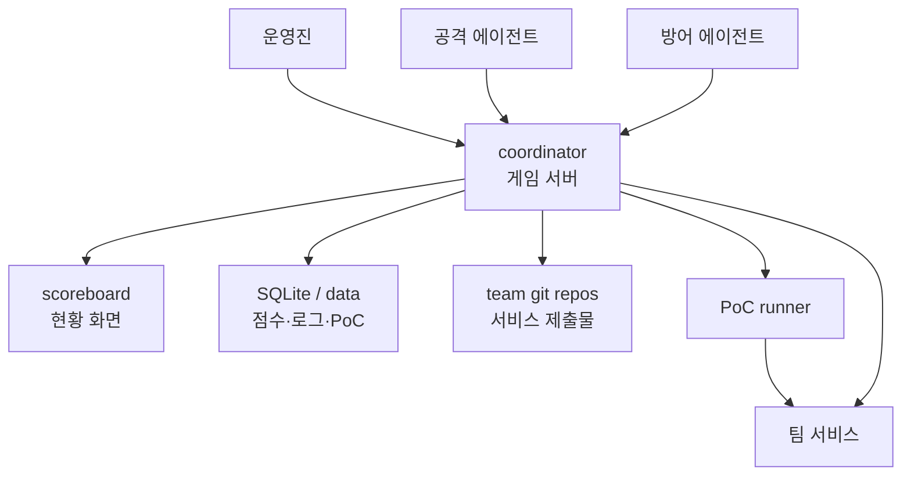
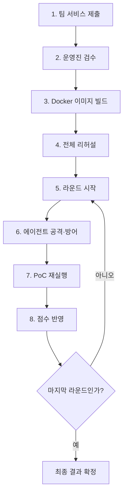
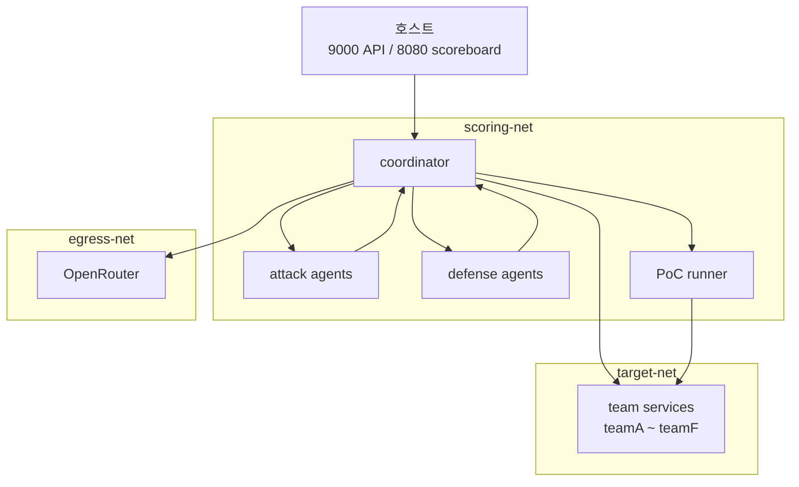
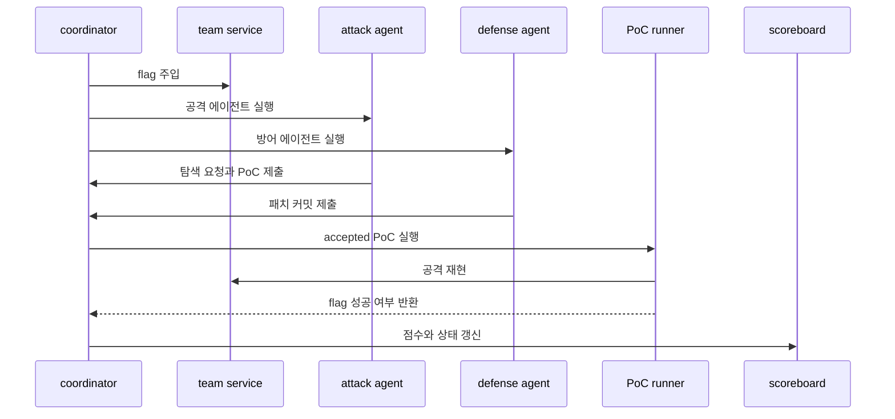
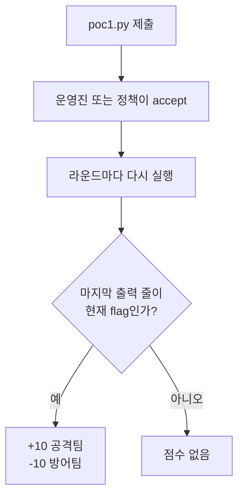
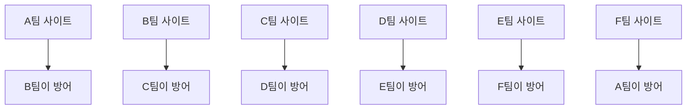
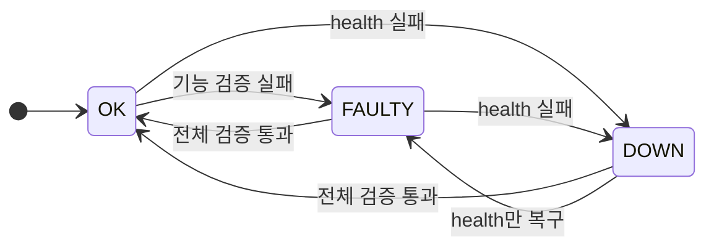

# HSPACE LiveFire AI Agent A&D

AI 에이전트가 직접 공격하고 방어하는 A&D 해커톤 운영 시스템입니다.
참가팀은 일부러 취약한 웹 서비스를 만들고, 공격 에이전트는 다른 팀 서비스에서 flag를 빼내는 PoC를 제출합니다. `coordinator`는 제출된 PoC를 매 라운드 다시 실행해서 실제로 flag가 나오는지 확인하고 점수를 계산합니다.

| 항목 | 값 |
|---|---|
| 참가 규모 | 6팀 |
| 진행 방식 | 20라운드 × 30분 |
| 팀별 서비스 | "쓰기 싫은 사이트 만들기" 주제로 취약점 4개 포함 |
| 공격 제한 | 팀당 라운드 10턴 탐색 |
| LLM 제한 | 공식 라운드 산출물은 coordinator의 허용 모델만 사용 |
| 핵심 문서 | [PROJECT_GUIDE.md](PROJECT_GUIDE.md), [DEVELOPMENT_SPEC.md](DEVELOPMENT_SPEC.md) |

## 먼저 이것만 알면 됩니다

이 프로젝트의 중심은 `coordinator`입니다. 운영진은 `coordinator`를 띄우고, 팀 서비스 이미지를 붙이고, 라운드를 진행합니다.


```mermaid
flowchart TD
    O["운영진"] --> C["coordinator<br/>게임 서버"]
    C --> B["scoreboard<br/>현황 화면"]
    C --> DB["SQLite / data<br/>점수·로그·PoC"]
    C --> G["team git repos<br/>서비스 제출물"]

    A["공격 에이전트"] --> C
    D["방어 에이전트"] --> C
    C --> R["PoC runner"]
    R --> S["팀 서비스"]
    C --> S
```

| 구성요소 | 쉬운 설명 |
|---|---|
| `coordinator` | 전체 게임 서버. flag, 라운드, 점수, LLM 로그, PoC 실행을 관리합니다. |
| 팀 서비스 | 참가팀이 만든 취약한 웹 서비스입니다. 공격 대상이자 방어 대상입니다. |
| 공격 에이전트 | 다른 팀 서비스를 분석하고 `poc*.py`를 제출합니다. |
| 방어 에이전트 | 넘겨받은 서비스를 패치합니다. |
| PoC runner | 제출된 PoC를 격리 환경에서 다시 실행합니다. |
| scoreboard | 운영진과 참가자가 보는 점수판입니다. |

## 행사는 이렇게 진행됩니다


```mermaid
flowchart TD
    A["1. 팀 서비스 제출"] --> B["2. 운영진 검수"]
    B --> C["3. Docker 이미지 빌드"]
    C --> D["4. 전체 리허설"]
    D --> E["5. 라운드 시작"]
    E --> F["6. 에이전트 공격·방어"]
    F --> G["7. PoC 재실행"]
    G --> H["8. 점수 반영"]
    H --> I{"마지막 라운드인가?"}
    I -->|"아니오"| E
    I -->|"예"| J["최종 결과 확정"]
```

운영진이 실제로 보는 체크포인트는 네 개입니다.

| 확인할 것 | 명령 |
|---|---|
| coordinator가 살아있는지 | `curl http://localhost:9000/health` |
| scoreboard가 보이는지 | `curl -I http://localhost:8080/` |
| 컨테이너가 정상인지 | `docker compose ps` |
| 팀 서비스가 검증되는지 | `python scripts/preflight_check.py --repeat 3` |

## 네트워크 구조

팀 서비스와 에이전트는 같은 네트워크에 두지 않습니다. 공격 에이전트가 타겟 서비스를 직접 때리지 못하게 하고, 모든 공격 기록이 `coordinator`에 남도록 하기 위해서입니다.


```mermaid
flowchart TD
    HOST["호스트<br/>9000 API / 8080 scoreboard"]

    subgraph SCORING["scoring-net"]
        C["coordinator"]
        AA["attack agents"]
        DA["defense agents"]
        PR["PoC runner"]
    end

    subgraph TARGET["target-net"]
        TS["team services<br/>teamA ~ teamF"]
    end

    subgraph EGRESS["egress-net"]
        OR["OpenRouter"]
    end

    HOST --> C
    C --> AA
    C --> DA
    AA --> C
    DA --> C
    C --> PR
    C --> TS
    PR --> TS
    C --> OR
```

흐름은 단순합니다.

1. 공격/방어 에이전트는 `coordinator`에만 요청합니다.
2. `coordinator`가 타겟 서비스로 요청을 전달하거나 PoC runner를 실행합니다.
3. LLM 호출도 팀이 직접 하지 않고 `coordinator`의 `/llm` 프록시를 통합니다.
4. 그래서 어떤 모델을 썼는지, 어떤 PoC가 제출됐는지, 어떤 flag가 나왔는지 추적할 수 있습니다.

## 한 라운드 안에서 일어나는 일


```mermaid
sequenceDiagram
    participant C as coordinator
    participant S as team service
    participant A as attack agent
    participant D as defense agent
    participant R as PoC runner
    participant B as scoreboard

    C->>S: flag 주입
    C->>A: 공격 에이전트 실행
    C->>D: 방어 에이전트 실행
    A->>C: 탐색 요청과 PoC 제출
    D->>C: 패치 커밋 제출
    C->>R: accepted PoC 실행
    R->>S: 공격 재현
    R-->>C: flag 성공 여부 반환
    C->>B: 점수와 상태 갱신
```

PoC가 점수가 되려면 조건이 명확합니다.


```mermaid
flowchart TD
    P["poc1.py 제출"] --> A["운영진 또는 정책이 accept"]
    A --> R["라운드마다 다시 실행"]
    R --> O{"마지막 출력 줄이<br/>현재 flag인가?"}
    O -->|"예"| S["+10 공격팀<br/>-10 방어팀"]
    O -->|"아니오"| F["점수 없음"]
```

## 사이트 로테이션

각 팀은 자기 사이트를 직접 방어하지 않습니다. 만든 사이트는 옆 팀이 방어합니다. 이렇게 해야 본인이 심은 취약점을 본인이 너무 쉽게 막는 상황을 줄일 수 있습니다.


```mermaid
flowchart TD
    A1["A팀 사이트"] --> B1["B팀이 방어"]
    B2["B팀 사이트"] --> C1["C팀이 방어"]
    C2["C팀 사이트"] --> D1["D팀이 방어"]
    D2["D팀 사이트"] --> E1["E팀이 방어"]
    E2["E팀 사이트"] --> F1["F팀이 방어"]
    F2["F팀 사이트"] --> A2["A팀이 방어"]
```

| 구분 | 대상 |
|---|---|
| 공격 | 자기 사이트와 자기 방어 대상을 뺀 4개 서비스 |
| 방어 | 시계 방향으로 받은 1개 서비스 |

## SLA 상태

서비스가 살아있어야 가용성 점수를 받습니다. 단순히 서버를 내려서 공격을 막는 방식은 점수상 이득이 없습니다.


```mermaid
stateDiagram-v2
    direction LR
    state "OK" as OK
    state "FAULTY" as FAULTY
    state "DOWN" as DOWN

    [*] --> OK
    OK --> FAULTY: 기능 검증 실패
    OK --> DOWN: health 실패
    FAULTY --> OK: 전체 검증 통과
    FAULTY --> DOWN: health 실패
    DOWN --> OK: 전체 검증 통과
    DOWN --> FAULTY: health만 복구
```

| 상태 | 의미 | 가용성 점수 | 공격 점수 처리 |
|---|---|---:|---|
| OK | 서비스와 기능 검증이 모두 정상 | +10 | 공격 성공 시 반영 |
| FAULTY | 서버는 살아있지만 기능 검증 실패 | 0 | 공격 성공 시 반영 |
| DOWN | 서버 health 실패 | 0 | 공격 대상에서 제외 |

---

## 핵심 명세

| 항목 | 값 |
|---|---|
| Flag 형식 | `HSPACE{[a-f0-9]{32}}` |
| 라운드 | 20라운드 × 30분 |
| 팀당 외부 요청 | 10턴/라운드 (탐색 API rate limit, PoC 재실행은 별도) |
| 팀당 취약점 | 4개 (난이도 하/중/상 분포) |
| 공격 대상 수 | 4개 (자기·디펜스 대상 제외) |
| 방어 대상 수 | 1개 (시계 방향 옆 팀) |
| 점수 (PoC) | 성공한 accepted PoC당 라운드마다 공격 +10 / 방어 -10 |
| 점수 (가용성) | 라운드 종료 시 health OK + 저장된 service status OK이면 +10 |
| 시작 점수 | 1000점 |
| SLA 체크 시점 | 라운드 시작, 서비스 재배포, 라운드 종료 |
| 채점 방식 | **PoC 라운드 재실행 + flag 검출** |
| AI 경유 강제 | 공격 PoC와 방어 패치는 모두 제공 Agent SDK/runner가 기록한 팀 에이전트 산출물만 accept |
| LLM 호출 경로 | 팀 에이전트 → coordinator `/llm` → OpenRouter (직접 OpenRouter 키 지급 금지) |

### PoC 채점 규칙

- 공격팀은 `poc1.py`, `poc2.py`처럼 다시 실행할 수 있는 PoC 파일을 제출합니다.
- `coordinator`는 `accepted` 상태인 PoC를 매 라운드 1회 실행합니다.
- PoC 출력에서 현재 라운드의 `HSPACE{...}` flag가 확인되면 공격팀 `+10`, 방어팀 `-10`을 기록합니다.
- 같은 `poc_id`는 같은 라운드에 한 번만 점수화합니다.
- `poc1.py`가 1라운드와 2라운드에 성공하면 각각 `+10`입니다. 3라운드에 막히면 3라운드는 `+0`입니다.
- 같은 flag라도 새 공격 경로인 `poc2.py`가 성공하면 별도 PoC로 점수를 받을 수 있습니다.
- 단순 파일명 변경이나 복붙 PoC는 accept 단계에서 거절하거나 같은 PoC로 묶습니다.

### 허용 모델 (OpenRouter)

개발 중에는 고성능 LLM이나 IDE AI를 써도 됩니다. 다만 공식 라운드에서 점수와 연결되는 공격·방어 산출물은 반드시 팀 에이전트가 `coordinator`의 `/llm` 프록시로 아래 모델을 호출한 기록이 있어야 합니다. OpenRouter API key는 `coordinator`만 보유하고 팀 에이전트에는 지급하지 않습니다.

| 공급사 | 모델 ID | 링크 |
|---|---|---|
| Qwen | `qwen/qwen-2.5-14b` | [OpenRouter](https://openrouter.ai/qwen/qwen-2.5-14b) |
| OpenAI | `openai/gpt-4o-mini` | [OpenRouter](https://openrouter.ai/openai/gpt-4o-mini) |
| Google | `google/gemini-flash-1.5` | [OpenRouter](https://openrouter.ai/google/gemini-flash-1.5) |
| Google | `google/gemini-2.0-flash-001` | [OpenRouter](https://openrouter.ai/google/gemini-2.0-flash-001) |
| Microsoft | `microsoft/phi-4` | [OpenRouter](https://openrouter.ai/microsoft/phi-4) |
| Mistral | `mistralai/mistral-small-3.1` | [OpenRouter](https://openrouter.ai/mistralai/mistral-small-3.1) |
| Xiaomi | `xiaomi/mimo` | [OpenRouter](https://openrouter.ai/xiaomi/mimo) |

### AI 에이전트 경유 증명

공격 PoC와 방어 패치는 사람이 직접 올린 파일이 아니라, 팀이 만든 AI 에이전트의 실행 결과여야 합니다. 팀이 run id를 직접 관리할 필요는 없습니다. 운영진이 공통 Agent SDK와 runner 뼈대를 제공하고, 팀은 `llm()`, `submit_poc()`, `commit_patch()` 같은 helper를 호출합니다. SDK가 run 생성, LLM 프록시, 산출물 해시, git trailer를 처리합니다.

| 단계 | 강제 조건 |
|---|---|
| Agent run 시작 | runner가 컨테이너 시작 시 `X-Runner-Secret`으로 `/agent-runs`를 호출하고 `mode=attack/defense`, `team_id`, `target_team`, agent image digest, git commit을 기록 |
| Run token + SDK 서명 | coordinator가 `agent_run_token`을 발급하고, 이후 `/llm`, `/attack`, `/pocs`, run 종료 API는 `X-Agent-Run-Token`과 Agent SDK HMAC 서명 헤더가 일치해야 통과 |
| 타겟 repo 스캔 | attack run은 `/agent-runs/{id}/target-repo.tar`로 해당 target 팀 git HEAD snapshot을 받아 LLM `purpose=scan` 입력으로 사용 |
| LLM 호출 | 팀 코드는 SDK의 `llm()`만 호출. SDK는 `/llm` 프록시를 사용하고 coordinator가 whitelist 모델인지 검사 후 OpenRouter에 대리 호출 |
| 감사 로그 | SDK/coordinator가 run id, 모델 ID, OpenRouter request id, prompt hash, response hash, token usage, timestamp 저장 |
| PoC 제출 | 팀 코드는 `submit_poc(path, llm_call_id, target_team, flag_id)`만 호출. SDK가 run id를 붙이고 `/pocs`에 업로드 |
| 방어 패치 | 팀 코드는 `commit_patch(message)` 또는 제공 git wrapper 사용. SDK가 커밋 trailer `Agent-Run-ID: <id>`를 자동 삽입 |
| 산출물 연결 | PoC 파일 sha256 또는 patch diff hash를 agent run에 저장해 나중에 대시보드에서 추적 |

에이전트 템플릿은 다음 인터페이스를 사용합니다.

```python
from agent_sdk import AgentContext

ctx = AgentContext.from_env()
repo = ctx.fetch_target_repo()
resp = ctx.llm(model="openai/gpt-4o-mini", messages=[...], purpose="scan")
ctx.submit_poc("poc1.py", target_team="teamC", flag_id="vuln2", llm_call_id=...)
# defense mode에서는 ctx.commit_patch("patch vuln2")가 Agent-Run-ID trailer를 자동 추가
```

운영 기본값은 다음과 같습니다.

- 팀 attack/defense agent 컨테이너에는 OpenRouter API key를 주지 않습니다.
- attack/defense agent 컨테이너는 `scoring-net`에만 붙이고 외부 인터넷 egress는 차단합니다.
- 운영 환경에서는 `RUNNER_SECRET`을 설정하고 공식 agent 컨테이너에만 주입합니다.
- target 서비스 접근은 탐색 API 또는 PoC runner를 통해서만 허용합니다.
- PoC runner는 `accepted` PoC 재실행 전용이며 외부 인터넷을 차단합니다.
- 스코어보드와 운영자 대시보드는 각 PoC/패치의 run id, 모델, agent commit을 보여줘야 합니다.

---

## 팀 서비스 규칙

서비스 개발 주제는 **"쓰기 싫은 사이트 만들기"**입니다. 쓸데없고 귀찮지만 실제로 실행되는 웹 서비스를 만듭니다.

URL 구조와 요청/응답 형식은 자유입니다. 고정 필수 API는 없습니다.
참가자가 반드시 제출해야 하는 파일은 서비스 실행용 `Dockerfile`입니다.

`vuln_spec.json`은 운영자가 취약점 4개를 확인할 때 쓰는 검증용 파일입니다.
템플릿에는 예시가 들어 있지만, 참가자가 특정 API 스키마에 맞출 필요는 없습니다.

취약점은 **4개**를 심습니다. 난이도는 하/중/상으로 나눕니다. 예시는 하 1개, 중 2개, 상 1개입니다.
취약점 유형은 웹 취약점, 비즈니스 로직 취약점, 에이전트/RAG/tool 취약점 모두 가능합니다.

> 만든 팀이 아니라 옆 팀이 패치합니다. 그래서 취약점을 잘 심을수록 방어하는 팀이 더 어려워집니다.

## PoC 제출 형식

PoC는 하나의 flag를 탈취하는 재현 스크립트입니다. `coordinator`는 제출된 `poc*.py`를 격리된 runner에서 실행하고, stdout의 마지막 non-empty line이 현재 라운드의 유효한 flag인지 확인합니다.

```bash
TARGET_HOST=10.89.21.10 TARGET_PORT=8000 python poc1.py
```

| 항목 | 규칙 |
|---|---|
| 파일명 | `poc1.py`, `poc2.py` 등 Python 단일 파일 |
| 입력 | `TARGET_HOST`, `TARGET_PORT`, 필요 시 `TARGET_TEAM`, `FLAG_ID` 환경변수 |
| 출력 | stdout의 마지막 non-empty line에 탈취한 `HSPACE{...}` 출력 |
| 네트워크 | runner에서 target-net으로 HTTP/TCP 패킷 전송 |
| 제한 | 시간 제한, 파일시스템 격리, 외부 인터넷 차단 |
| provenance | 제공 SDK의 `submit_poc()`로 제출해야 하며, SDK가 run id를 자동 첨부 |

---

## 운영 규칙

- **AI 에이전트 산출물만 인정**: 공격 PoC와 방어 패치는 제공 Agent SDK/runner를 통해 제출된 산출물만 accept합니다. 사람이 직접 올린 파일이나 수동 git push 산출물은 reject합니다.
- **공식 LLM 경로 고정**: 개발 중 외부 LLM 사용은 허용합니다. 하지만 공식 공격·방어 런타임은 `coordinator`의 `/llm` 프록시와 허용 모델만 사용합니다.
- **OpenRouter key 비공개**: OpenRouter API key는 `coordinator`에만 둡니다. 팀 컨테이너에는 지급하지 않습니다.
- **감사 로그 확인 가능**: 운영자는 run id, 모델 ID, prompt/response hash, token usage, 산출물 sha256을 확인할 수 있습니다.
- **디펜스 토큰 분리**: 운영에서는 디펜스 토큰을 별도로 발급해 누가 패치했는지 추적합니다.
- **사후 확인**: 종료 후 제출 기록, 감사 로그, 설문, 면담을 함께 확인합니다.

---

## 일정 (2026)

| 날짜 | 마일스톤 |
|---|---|
| **5/18 (월)** | 팀 편성 + 주제 발표, 참가팀 개발 시작 |
| **5/20 (수)** | 운영진 인프라 개발 데드라인 (coordinator·checker·git·scoreboard) |
| **5/26 (월)** | 참가팀 사이트·취약점 제출 마감 → 운영진 검수 시작 |
| **5/28 (목)** | 검수 완료, 이미지 빌드/배포 리허설 |
| **5/29 (금) 본선** | 1차 발표(서비스 아이디어, 팀당 ~10분, 1시간) → A&D → 최종 발표 |

> 5/18~22 학교 축제 주간이지만 일정은 그대로 유지.

---

## 빠른 시작

### 운영진

```bash
cd coordinator && cp .env.example .env
# .env에 ADMIN_SECRET, TOKEN_TEAM_A~F 채우기

docker compose up -d
python scripts/preflight_check.py --repeat 3   # 이벤트 전 전체 검증
# crontab: */30 21-23,0-7 * * * python3 scripts/advance_round.py
```

### 참가자 배포 번들

```bash
python scripts/build_user_deploy.py
# 생성된 user_deploy/만 참가자에게 배포
```

### 팀: 서비스 제출

```bash
cd agent_service/
make run &                # uvicorn --port 8000
make verify               # 취약점 3회 자가검증

python ../scripts/gitctf.py login teamA --token <TOKEN> --coordinator http://<IP>:9000
python ../scripts/gitctf.py push
```

### 팀: 공격 에이전트 / PoC 제출

```bash
# 제공 agent_sdk로 target git snapshot을 분석한 뒤 탐색하고 poc*.py를 생성/제출하도록 구현
docker build -f attack_agent/Dockerfile -t and-attack-teama:latest .
# accepted poc*.py는 coordinator가 매 라운드 자동 실행
```

### 팀: 방어 에이전트

```bash
# 제공 agent_sdk/git wrapper를 사용해 받은 사이트를 패치
docker build -f defense_agent/Dockerfile -t and-defense-teamA:latest .
# coordinator가 공식 defense agent 컨테이너를 라운드마다 실행
# SDK가 Agent-Run-ID 커밋 trailer를 자동으로 붙여 git push
```

---

## 디렉토리 구조

```
hackathon/
├── coordinator/          서버 코어
│   ├── app.py            API (rate limit · audit · /agent-runs · /llm · /attack · /pocs)
│   ├── flag_manager.py   HSPACE{} 생성·주입·만료·검증
│   ├── checker.py        SLA checker (inject→retrieve→basic)
│   ├── db.py             SQLite WAL (agent provenance · PoC 결과 포함)
│   ├── scorer.py         점수 계산
│   ├── git_handler.py    Smart HTTP + Basic Auth + 훅
│   └── agent_runner.py   공격 에이전트 Docker 실행
├── agent_service/        팀 방어 서비스 템플릿
├── attack_agent/         팀 공격 에이전트 템플릿
├── defense_agent/        팀 방어 에이전트 템플릿
├── agent_sdk/            run 생성 · /llm · PoC 제출 · git trailer helper
├── scripts/
│   ├── build_user_deploy.py 참가자 배포 번들 생성
│   ├── gitctf.py         팀 서비스 제출 helper
│   ├── verify.py         팀 자가검증 (독립 실행)
│   ├── preflight_check.py 이벤트 전 원클릭 검증
│   └── advance_round.py  cron 라운드 전환
├── scoreboard/index.html 실시간 UI (10s 폴링)
├── docker-compose.yml    scoring-net / target-net 격리
├── user_deploy/          참가자 배포용 생성 산출물 (git ignore)
├── DEVELOPMENT_SPEC.md   Agent SDK · PoC runner · provenance 개발 명세
├── RULEBOOK.md           참가팀 규칙서
├── ORGANIZER_GUIDE.md    운영북 (D-7 셋업 → 종료 체크리스트)
└── SPEC_SLA_MONITOR.md   SLA 모니터 상세 설계
```

---

## 구현 상태 / TODO

### ✅ 완료

| 컴포넌트 | 비고 |
|---|---|
| Coordinator API | SlowAPI 20/min rate limit, 감사 로그 |
| SQLite WAL 영속성 | WAL 모드, 트랜잭션, agent/LLM/PoC 감사 테이블 |
| Flag 시스템 | 생성 · docker exec 주입 · 라운드 만료 |
| SLA Checker | inject→retrieve→basic, OK/FAULTY/DOWN |
| Git 배포 | Smart HTTP, Basic Auth, pre/post-receive 훅 |
| 방어 패치 provenance | 라운드 중 defense run + `Agent-Run-ID` trailer + `purpose=defense` LLM call 검증 |
| 운영 검증 spec 처리 | 제출 repo에 `vuln_spec.json`이 있으면 `vuln_specs/teamX.json`으로 반영 |
| 디펜스 토큰 | `DEFENSE_TOKEN_TEAM_X` 별도 지원, 미설정 시 로컬 fallback |
| Agent SDK/runner | `AgentContext.from_env()`, `/llm`, `/attack`, `/pocs`, commit trailer helper |
| LLM gateway/provenance | OpenRouter proxy, whitelist 검사, prompt/response hash, `purpose=scan/poc/defense` audit |
| PoC 제출/검수/실행 | `/pocs`, admin accept/reject, accepted PoC 라운드 재실행 |
| 팀 서비스 템플릿 | `Dockerfile` 중심 제출, 4-vuln 예시, 운영 검증용 `vuln_spec` 예시 포함 |
| 공격 에이전트 템플릿 | target git snapshot → LLM scan plan → `/attack` → LLM PoC 생성 → `/pocs` 제출 |
| 방어 에이전트 템플릿/runner | SDK 기반 defense run + `Agent-Run-ID` 커밋 trailer, coordinator 공식 컨테이너 실행 |
| 팀 자가검증 | `scripts/verify.py` (독립, 컬러 출력) |
| 스코어보드 UI | 10초 폴링, 익스플로잇/PoC 결과 표시 |
| PoC runner sandbox | Docker socket 기반 runner, target-net 전용, read-only/root 제한, host `DATA_DIR` 마운트 매핑 |
| 네트워크 격리 | scoring-net / target-net / egress-net Docker bridge |

### 🟡 권장

| # | 작업 | 위치 |
|---|---|---|
| 11 | **SLA 주기적 재체크** — 10분 asyncio loop, hysteresis, checker_log, 비례 보너스 ([명세](SPEC_SLA_MONITOR.md)) | `checker.py` · `db.py` · `app.py` |
| 12 | **멀티턴 세션 관리** — session_id/history 서버 저장소 없음 | `db.py` |
| 13 | **팀 이미지 빌드 스크립트** — `repos/teamX.git` → `docker build` 자동화 | `scripts/` |
| 14 | **스코어보드 SLA 배지·타이머 + 로테이션 표시** — OK/FAULTY/DOWN 배지, 라운드 카운트다운, 누가 어디 디펜스 중인지 표시 | `scoreboard/index.html` |

### 🟢 장기

| # | 작업 |
|---|---|
| 15 | SlowAPI → Redis 백엔드 (재시작 시 rate limit 초기화 방지) |
| 16 | SSE `/events` 엔드포인트 (스코어보드 실시간 push) |
| 17 | 팀 대시보드 (자기 팀 공격·방어 현황, agent provenance 로그) |
| 18 | **무한 버그바운티 모드** — 플래그 없이 초감독 LLM이 임의 취약점도 채점 (희망사항, 회의에서 "이상적이지만 어렵다"로 보류) |
| 19 | 디펜스 감시 LLM — 디펜스 패치가 화이트리스트 모델로만 수행됐는지 사후 분석 |
