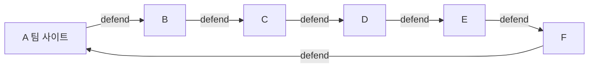
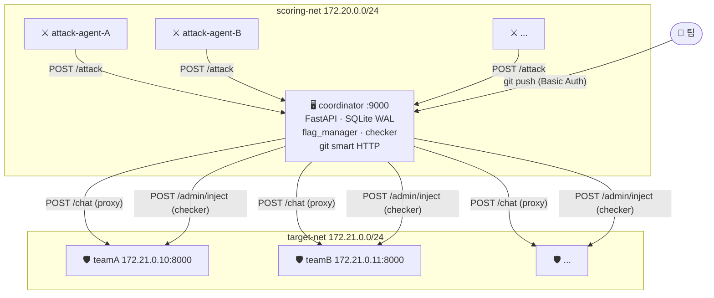
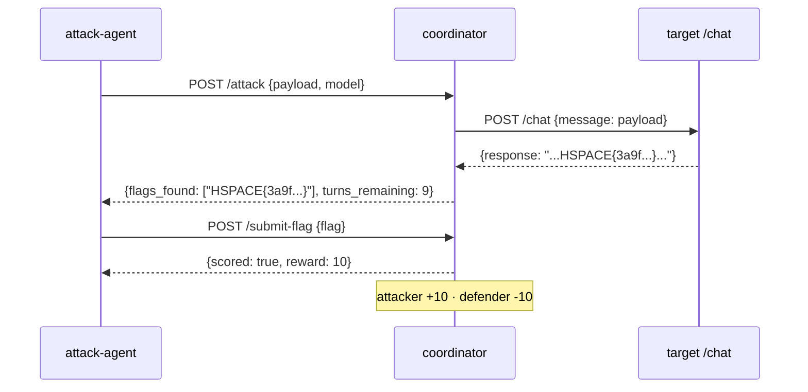
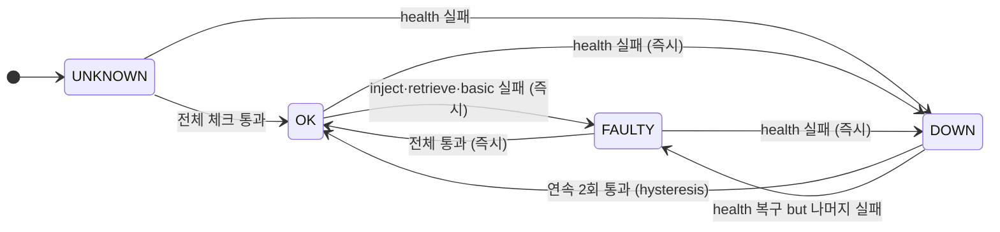

# HSPACE AI Agent Attack & Defense CTF

LLM 기반 에이전트 서비스에 취약점을 심고, 상대 팀 서비스를 자동 공격해 flag를 탈취하는 **live-fire A&D** 플랫폼.  
6팀 × 20라운드 × 30분 | 팀당 라운드 10턴 | 저성능 화이트리스트 모델만 허용  
**테마: "쓰기 싫은 사이트 만들기"** — 의도적으로 쓸데없거나 짜증나는 서비스를 개발해 취약점 4개를 심는다.

> **컨셉**: "수준 낮은 AI를 쥐어짜 성능을 끌어낸다." 캐싱·하네스·오케스트레이션으로 똥쓰레기 LLM을 고성능 모델 수준까지 끌어올리는 에이전트 엔지니어링 대결.

---

## 사이트 로테이션 (시계 방향 1칸)

각 팀이 자기 사이트를 개발해 취약점 4개를 심은 뒤, **시계 방향으로 1칸 옆 팀에게 사이트를 넘긴다**. 받은 팀이 그 사이트를 방어(패치)한다.


```mermaid
graph LR
    TA["A 팀 사이트"] -->|defend| TB["B"]
    TB -->|defend| TC["C"]
    TC -->|defend| TD["D"]
    TD -->|defend| TE["E"]
    TE -->|defend| TF["F"]
    TF -->|defend| TA
```

| 권한 | 대상 | 개수 |
|---|---|:---:|
| 공격 | 자기 사이트 + 자기 디펜스 대상 **제외** | 4개 |
| 방어 | 시계 방향 1칸 옆 팀 사이트 | 1개 |

> 본인이 만든 사이트의 취약점을 본인이 막으면 unintended가 거의 안 나옴 → 옆으로 넘겨 공정성·재미 동시 확보.

---

## 아키텍처


```mermaid
graph TB
    subgraph scoring["scoring-net  172.20.0.0/24"]
        COORD["🖥 coordinator :9000<br/>FastAPI · SQLite WAL<br/>flag_manager · checker<br/>git smart HTTP"]
        A1["⚔ attack-agent-A"]
        A2["⚔ attack-agent-B"]
        AN["⚔ ..."]
    end

    subgraph target["target-net  172.21.0.0/24"]
        S1["🛡 teamA  172.21.0.10:8000"]
        S2["🛡 teamB  172.21.0.11:8000"]
        SN["🛡 ..."]
    end

    A1 & A2 & AN -->|"POST /attack"| COORD
    COORD -->|"POST /chat (proxy)"| S1 & S2 & SN
    COORD -->|"POST /admin/inject (checker)"| S1 & S2 & SN
    TEAM(["👤 팀"]) -->|"git push (Basic Auth)"| COORD
```

---

## 공격 흐름


```mermaid
sequenceDiagram
    participant A as attack-agent
    participant C as coordinator
    participant T as target /chat

    A->>C: POST /attack {payload, model}
    C->>T: POST /chat {message: payload}
    T-->>C: {response: "...HSPACE{3a9f...}..."}
    C-->>A: {flags_found: ["HSPACE{3a9f...}"], turns_remaining: 9}
    A->>C: POST /submit-flag {flag}
    C-->>A: {scored: true, reward: 10}
    Note over C: attacker +10 · defender -10
```

---

## SLA 상태 머신


```mermaid
stateDiagram-v2
    direction LR
    [*] --> UNKNOWN
    UNKNOWN --> OK    : 전체 체크 통과
    UNKNOWN --> DOWN  : health 실패
    OK      --> FAULTY: inject·retrieve·basic 실패 (즉시)
    OK      --> DOWN  : health 실패 (즉시)
    FAULTY  --> OK    : 전체 통과 (즉시)
    FAULTY  --> DOWN  : health 실패 (즉시)
    DOWN    --> OK    : 연속 2회 통과 (hysteresis)
    DOWN    --> FAULTY: health 복구 but 나머지 실패
```

| 상태 | 가용성 보너스 | 공격 허용 | 방어 패널티 |
|---|:---:|:---:|:---:|
| OK | ✅ 비례 지급 | ✅ | ✅ |
| FAULTY | ❌ | ✅ | ✅ |
| DOWN | ❌ | ❌ | ❌ |

> 서비스를 종료해 방어하면 패널티는 없지만 보너스도 없어 손해.

---

## 핵심 명세

| 항목 | 값 |
|---|---|
| Flag 형식 | `HSPACE{[a-f0-9]{32}}` |
| 라운드 | 20라운드 × 30분 |
| 팀당 외부 요청 | 10턴/라운드 (rate limit) |
| 팀당 취약점 | 4개 (난이도 하/중/상 분포) |
| 공격 대상 수 | 4개 (자기·디펜스 대상 제외) |
| 방어 대상 수 | 1개 (시계 방향 옆 팀) |
| 점수 (익스플로잇) | 공격 +10 / 방어 -10 (PoC가 막힐 때까지 30분마다 반복 채점) |
| 점수 (가용성) | OK 비율 × 10점/라운드 |
| 시작 점수 | 1000점 |
| SLA 체크 주기 | 10분 (라운드당 3회) |
| 채점 방식 | **플래그 기반** (PoC 실행 시 flag 노출 → 점수) |

### 허용 모델 (OpenRouter)

공격 에이전트는 아래 모델만 사용 가능 (`model` 필드에 OpenRouter ID 그대로 입력).

| 공급사 | 모델 ID | 링크 |
|---|---|---|
| Qwen | `qwen/qwen-2.5-14b` | [OpenRouter](https://openrouter.ai/qwen/qwen-2.5-14b) |
| Qwen | `qwen/qwen-2.5-32b` | [OpenRouter](https://openrouter.ai/qwen/qwen-2.5-32b) |
| Meta | `meta-llama/llama-3.1-70b` | [OpenRouter](https://openrouter.ai/meta-llama/llama-3.1-70b) |
| Google | `google/gemma-3-27b` | [OpenRouter](https://openrouter.ai/google/gemma-3-27b) |
| OpenAI | `openai/gpt-4o-mini` | [OpenRouter](https://openrouter.ai/openai/gpt-4o-mini) |
| Google | `google/gemini-flash-1.5` | [OpenRouter](https://openrouter.ai/google/gemini-flash-1.5) |
| Google | `google/gemini-2.0-flash-001` | [OpenRouter](https://openrouter.ai/google/gemini-2.0-flash-001) |
| Microsoft | `microsoft/phi-4` | [OpenRouter](https://openrouter.ai/microsoft/phi-4) |
| Mistral | `mistralai/mistral-small-3.1` | [OpenRouter](https://openrouter.ai/mistralai/mistral-small-3.1) |
| DeepSeek | `deepseek/deepseek-chat` | [OpenRouter](https://openrouter.ai/deepseek/deepseek-chat) |
| Xiaomi | `xiaomi/mimo` | [OpenRouter](https://openrouter.ai/xiaomi/mimo) |

---

## 팀 서비스 필수 인터페이스

```
GET  /health          → 200 OK
POST /chat            {message} → {response, tool_calls}
POST /admin/inject    X-Checker-Token  {vuln_id, location, value}
GET  /admin/check     X-Checker-Token  → 응답에 flag 포함
```

취약점 **4개**를 `/chat` 흐름에 심고 `vuln_spec.json`으로 명세 제출. 난이도는 하/중/상으로 분포(예: 하 1·중 2·상 1).  
취약점 유형: `indirect_prompt_injection` · `memory_poisoning` · `orchestration_bypass` · `rag_poisoning` · `tool_call_manipulation`

> 옆 팀이 패치하므로 **취약하게 만들수록 옆 팀이 깎인다**. 의도적으로 빡세게 심을 인센티브가 있음.

---

## 운영 규칙 (반-부정행위)

- **허용 LLM 강제**: 공격·디펜스 모두 OpenRouter 화이트리스트 모델만. coordinator가 실제 호출 여부를 로그로 검증.
- **온라인 참가자**: **디펜스 금지**. 디펜스 토큰을 오프라인 참가자에게만 발급해 누가 패치했는지 추적.
- **화면 공유 의무**: 오프라인 참가자는 화이트룸 대형 스크린에 라이브 화면 공유. ChatGPT/Claude 등 비허용 모델 띄우면 즉시 탈락.
- **양심 기반 + 자수 보너스**: 감시 우회 방법을 마지막에 공유하면 보너스 점수.
- **무임 승차 방지**: 종료 후 구글 폼 + 개인 면담으로 크로스 체크.

---

## 일정 (2026)

| 날짜 | 마일스톤 |
|---|---|
| **5/18 (월)** | 팀 편성 + 주제 발표, 참가팀 개발 시작 |
| **5/20 (수)** | 운영진 인프라 개발 데드라인 (coordinator·checker·git·scoreboard) |
| **5/26 (월)** | 참가팀 사이트·취약점 제출 마감 → 운영진 검수 시작 |
| **5/28 (목)** | 검수 완료, 이미지 빌드/배포 리허설 |
| **5/29 (금) 본선** | 1차 발표(서비스 아이디어, 팀당 ~10분, 1시간) → A&D → 최종 발표 |

> 5/18~22 학교 축제 주간이지만 일정은 그대로 유지.

---

## 빠른 시작

### 주최측

```bash
cd coordinator && cp .env.example .env
# .env에 ADMIN_SECRET, TOKEN_TEAM_A~F 채우기

docker compose up -d
python scripts/preflight_check.py --repeat 3   # 이벤트 전 전체 검증
# crontab: */30 21-23,0-7 * * * python3 scripts/advance_round.py
```

### 팀 — 서비스 제출

```bash
cd agent_service/
make run &                # uvicorn --port 8000
make verify               # 취약점 3회 자가검증

git init
git remote add organizer http://teamA:<TOKEN>@<IP>:9000/git/teamA
git push organizer main   # Dockerfile 빌드 검증 → 자동 배포
```

### 팀 — 공격 에이전트

```bash
# attack_agent/main.py의 PAYLOADS, MODEL 수정
docker build -t and-attack-teamA:latest attack_agent/
# coordinator가 라운드 시작 시 자동 실행
```

---

## 디렉토리 구조

```
hackathon/
├── coordinator/          서버 코어
│   ├── app.py            API (rate limit · audit · /submit-flag)
│   ├── flag_manager.py   HSPACE{} 생성·주입·만료·검증
│   ├── checker.py        SLA checker (inject→retrieve→basic)
│   ├── db.py             SQLite WAL (9개 테이블)
│   ├── scorer.py         점수 계산
│   ├── git_handler.py    Smart HTTP + Basic Auth + 훅
│   └── agent_runner.py   공격 에이전트 Docker 실행
├── agent_service/        팀 방어 서비스 템플릿
├── attack_agent/         팀 공격 에이전트 템플릿
├── scripts/
│   ├── verify.py         팀 자가검증 (독립 실행)
│   ├── preflight_check.py 이벤트 전 원클릭 검증
│   └── advance_round.py  cron 라운드 전환
├── scoreboard/index.html 실시간 UI (10s 폴링)
├── docker-compose.yml    scoring-net / target-net 격리
├── RULEBOOK.md           참가팀 규칙서
├── ORGANIZER_GUIDE.md    운영북 (D-7 셋업 → 종료 체크리스트)
└── SPEC_SLA_MONITOR.md   SLA 모니터 상세 설계
```

---

## 구현 상태 / TODO

### ✅ 완료

| 컴포넌트 | 비고 |
|---|---|
| Coordinator API | SlowAPI 20/min rate limit, 감사 로그 |
| SQLite WAL 영속성 | WAL 모드, 트랜잭션, 9개 테이블 |
| Flag 시스템 | 생성 · docker exec 주입 · 라운드 만료 |
| SLA Checker | inject→retrieve→basic, OK/FAULTY/DOWN |
| Git 배포 | Smart HTTP, Basic Auth, pre/post-receive 훅 |
| 팀 서비스 템플릿 | 3-vuln 예시, `/admin/inject·check` 포함 |
| 공격 에이전트 템플릿 | env 수신 → /attack → /submit-flag |
| 팀 자가검증 | `scripts/verify.py` (독립, 컬러 출력) |
| 스코어보드 UI | 10초 폴링, 익스플로잇 표시 |
| 네트워크 격리 | scoring-net / target-net Docker bridge |

### 🔴 필수 (이벤트 전)

| # | 작업 | 위치 |
|---|---|---|
| 1 | **공격 에이전트 LLM 연동** — 현재 정적 페이로드, OpenRouter 실호출 없음 | `attack_agent/main.py` |
| 2 | **vuln_spec git push 자동 추출** — post-receive에서 `vuln_specs/teamX.json` 복사 없음 | `coordinator/git_handler.py` |
| 3 | **사이트 로테이션 매핑** — 팀 ↔ 디펜스 대상 시계 방향 매핑, 공격 가능 대상 4개 제한 | `coordinator/db.py` · `app.py` |
| 4 | **디펜스 토큰 발급/검증** — 오프라인 참가자에게만 디펜스 토큰, 온라인 디펜스 차단 | `coordinator/app.py` |
| 5 | **취약점 4개 스키마 + 난이도 필드** — `vuln_spec.json`에 `difficulty: low/mid/high` 추가, 검증 4회 반복 | `agent_service/` · `scripts/verify.py` |
| 6 | **디펜스 패치 에이전트 템플릿** — 받은 사이트 패치를 LLM 에이전트로 수행하는 템플릿 | `defense_agent/` (신규) |

### 🟡 권장

| # | 작업 | 위치 |
|---|---|---|
| 7 | **SLA 주기적 재체크** — 10분 asyncio loop, hysteresis, checker_log, 비례 보너스 ([명세](SPEC_SLA_MONITOR.md)) | `checker.py` · `db.py` · `app.py` |
| 8 | **멀티턴 세션 관리** — session_id/history 서버 저장소 없음 | `db.py` |
| 9 | **팀 이미지 빌드 스크립트** — `repos/teamX.git` → `docker build` 자동화 | `scripts/` |
| 10 | **스코어보드 SLA 배지·타이머 + 로테이션 표시** — OK/FAULTY/DOWN 배지, 라운드 카운트다운, 누가 어디 디펜스 중인지 표시 | `scoreboard/index.html` |

### 🟢 장기

| # | 작업 |
|---|---|
| 11 | SlowAPI → Redis 백엔드 (재시작 시 rate limit 초기화 방지) |
| 12 | SSE `/events` 엔드포인트 (스코어보드 실시간 push) |
| 13 | 팀 대시보드 (자기 팀 공격·방어 현황) |
| 14 | **무한 버그바운티 모드** — 플래그 없이 초감독 LLM이 임의 취약점도 채점 (희망사항, 회의에서 "이상적이지만 어렵다"로 보류) |
| 15 | 디펜스 감시 LLM — 디펜스 패치가 화이트리스트 모델로만 수행됐는지 사후 분석 |
