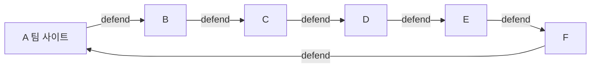
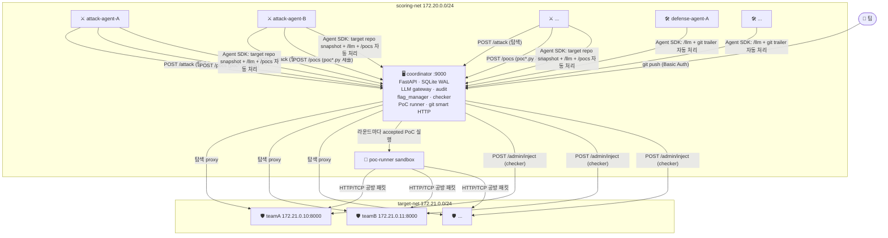
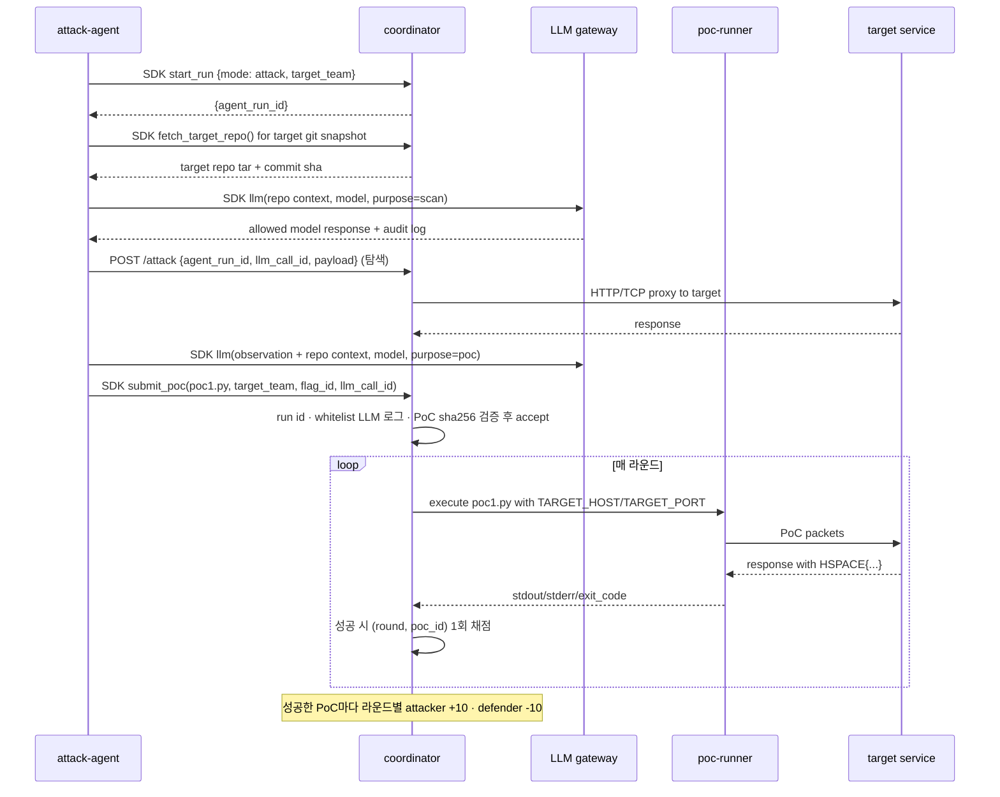
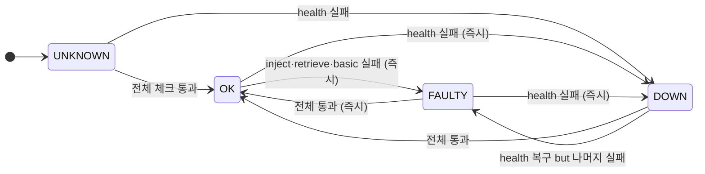

# HSPACE AI Agent Attack & Defense CTF

LLM 기반 에이전트가 로컬 네트워크에서 상대 팀 서비스를 탐색하고, 재현 가능한 `poc*.py`를 제출하면 coordinator가 매 라운드 PoC를 실행해 flag 탈취 여부로 채점하는 **live-fire A&D** 플랫폼.
6팀 × 20라운드 × 30분 | 팀당 라운드 10턴 탐색 | 저성능 화이트리스트 모델만 허용
**테마: "쓰기 싫은 사이트 만들기"** — 의도적으로 쓸데없거나 짜증나는 서비스를 개발해 취약점 4개를 심는다.

> **컨셉**: "수준 낮은 AI를 쥐어짜 성능을 끌어낸다." 캐싱·하네스·오케스트레이션으로 똥쓰레기 LLM을 고성능 모델 수준까지 끌어올리는 에이전트 엔지니어링 대결.

구현 기준 문서: [DEVELOPMENT_SPEC.md](DEVELOPMENT_SPEC.md)

---

## 사이트 로테이션 (시계 방향 1칸)

각 팀이 자기 사이트를 개발해 취약점 4개를 심은 뒤, **시계 방향으로 1칸 옆 팀에게 사이트를 넘긴다**. 받은 팀이 그 사이트를 방어(패치)한다.


```mermaid
graph LR
    TA["A 팀 사이트"] -->|defend| TB["B"]
    TB -->|defend| TC["C"]
    TC -->|defend| TD["D"]
    TD -->|defend| TE["E"]
    TE -->|defend| TF["F"]
    TF -->|defend| TA
```

| 권한 | 대상 | 개수 |
|---|---|:---:|
| 공격 | 자기 사이트 + 자기 디펜스 대상 **제외** | 4개 |
| 방어 | 시계 방향 1칸 옆 팀 사이트 | 1개 |

> 본인이 만든 사이트의 취약점을 본인이 막으면 방어 난이도가 낮아짐 → 옆으로 넘겨 공정성·재미 동시 확보.

---

## 아키텍처


```mermaid
graph TB
    subgraph scoring["scoring-net  172.20.0.0/24"]
        COORD["🖥 coordinator :9000<br/>FastAPI · SQLite WAL<br/>LLM gateway · audit<br/>flag_manager · checker<br/>PoC runner · git smart HTTP"]
        A1["⚔ attack-agent-A"]
        A2["⚔ attack-agent-B"]
        AN["⚔ ..."]
        D1["🛠 defense-agent-A"]
        DN["🛠 ..."]
        RUN["🧪 poc-runner sandbox"]
    end

    subgraph target["target-net  172.21.0.0/24"]
        S1["🛡 teamA  172.21.0.10:8000"]
        S2["🛡 teamB  172.21.0.11:8000"]
        SN["🛡 ..."]
    end

    A1 & A2 & AN -->|"POST /attack (탐색)"| COORD
    A1 & A2 & AN -->|"POST /pocs (poc*.py 제출)"| COORD
    A1 & A2 & AN -->|"Agent SDK: target repo snapshot + /llm + /pocs 자동 처리"| COORD
    D1 & DN -->|"Agent SDK: /llm + git trailer 자동 처리"| COORD
    COORD -->|"탐색 proxy"| S1 & S2 & SN
    COORD -->|"라운드마다 accepted PoC 실행"| RUN
    RUN -->|"HTTP/TCP 공방 패킷"| S1 & S2 & SN
    COORD -->|"POST /admin/inject (checker)"| S1 & S2 & SN
    TEAM(["👤 팀"]) -->|"git push (Basic Auth)"| COORD
```

---

## PoC 제출 및 채점 흐름


```mermaid
sequenceDiagram
    participant A as attack-agent
    participant C as coordinator
    participant L as LLM gateway
    participant R as poc-runner
    participant T as target service

    A->>C: SDK start_run {mode: attack, target_team}
    C-->>A: {agent_run_id}
    A->>C: SDK fetch_target_repo() for target git snapshot
    C-->>A: target repo tar + commit sha
    A->>L: SDK llm(repo context, model, purpose=scan)
    L-->>A: allowed model response + audit log
    A->>C: POST /attack {agent_run_id, llm_call_id, payload} (탐색)
    C->>T: HTTP/TCP proxy to target
    T-->>C: response
    A->>L: SDK llm(observation + repo context, model, purpose=poc)
    A->>C: SDK submit_poc(poc1.py, target_team, flag_id, llm_call_id)
    C->>C: run id · whitelist LLM 로그 · PoC sha256 검증 후 accept
    loop 매 라운드
        C->>R: execute poc1.py with TARGET_HOST/TARGET_PORT
        R->>T: PoC packets
        T-->>R: response with HSPACE{...}
        R-->>C: stdout/stderr/exit_code
        C->>C: 성공 시 (round, poc_id) 1회 채점
    end
    Note over C: 성공한 PoC마다 라운드별 attacker +10 · defender -10
```

---

## SLA 상태 머신


```mermaid
stateDiagram-v2
    direction LR
    [*] --> UNKNOWN
    UNKNOWN --> OK    : 전체 체크 통과
    UNKNOWN --> DOWN  : health 실패
    OK      --> FAULTY: inject·retrieve·basic 실패 (즉시)
    OK      --> DOWN  : health 실패 (즉시)
    FAULTY  --> OK    : 전체 통과 (즉시)
    FAULTY  --> DOWN  : health 실패 (즉시)
    DOWN    --> OK    : 전체 통과
    DOWN    --> FAULTY: health 복구 but 나머지 실패
```

| 상태 | 가용성 보너스 | 공격 허용 | 방어 패널티 |
|---|:---:|:---:|:---:|
| OK | ✅ +10/라운드 | ✅ | ✅ |
| FAULTY | ❌ | ✅ | ✅ |
| DOWN | ❌ | ❌ | ❌ |

> 서비스를 종료해 방어하면 패널티는 없지만 보너스도 없어 손해.

---

## 핵심 명세

| 항목 | 값 |
|---|---|
| Flag 형식 | `HSPACE{[a-f0-9]{32}}` |
| 라운드 | 20라운드 × 30분 |
| 팀당 외부 요청 | 10턴/라운드 (탐색 API rate limit, PoC 재실행은 별도) |
| 팀당 취약점 | 4개 (난이도 하/중/상 분포) |
| 공격 대상 수 | 4개 (자기·디펜스 대상 제외) |
| 방어 대상 수 | 1개 (시계 방향 옆 팀) |
| 점수 (PoC) | 성공한 accepted PoC당 라운드마다 공격 +10 / 방어 -10 |
| 점수 (가용성) | 라운드 종료 시 health OK + 저장된 service status OK이면 +10 |
| 시작 점수 | 1000점 |
| SLA 체크 시점 | 라운드 시작, 서비스 재배포, 라운드 종료 |
| 채점 방식 | **PoC 라운드 재실행 + flag 검출** |
| AI 경유 강제 | 공격 PoC와 방어 패치는 모두 제공 Agent SDK/runner가 기록한 팀 에이전트 산출물만 accept |
| LLM 호출 경로 | 팀 에이전트 → coordinator `/llm` → OpenRouter (직접 OpenRouter 키 지급 금지) |

### PoC 채점 규칙

- 공격팀은 `poc1.py`, `poc2.py`처럼 재현 가능한 PoC 파일을 제출한다.
- coordinator는 accepted PoC를 매 라운드 1회 실행한다.
- PoC 실행 결과에서 `HSPACE{...}` flag가 확인되면 해당 라운드에 공격 +10 / 방어 -10을 기록한다.
- 같은 `poc_id`는 같은 라운드에 한 번만 점수화한다.
- `poc1.py`가 1라운드와 2라운드에 성공하면 각각 +10, 3라운드에 막히면 +0이다.
- 같은 flag라도 새 공격 경로인 `poc2.py`가 4라운드에 성공하면 다시 +10을 준다.
- 단순 파일명 변경/복붙 PoC는 accept 단계에서 거절하거나 같은 PoC로 병합한다.

### 허용 모델 (OpenRouter)

공격·방어 에이전트는 아래 모델만 사용 가능하다. OpenRouter API key는 coordinator만 보유하고, 팀 에이전트는 coordinator의 `/llm` 프록시로만 호출한다.

| 공급사 | 모델 ID | 링크 |
|---|---|---|
| Qwen | `qwen/qwen-2.5-14b` | [OpenRouter](https://openrouter.ai/qwen/qwen-2.5-14b) |
| Qwen | `qwen/qwen-2.5-32b` | [OpenRouter](https://openrouter.ai/qwen/qwen-2.5-32b) |
| Meta | `meta-llama/llama-3.1-70b` | [OpenRouter](https://openrouter.ai/meta-llama/llama-3.1-70b) |
| Google | `google/gemma-3-27b` | [OpenRouter](https://openrouter.ai/google/gemma-3-27b) |
| OpenAI | `openai/gpt-4o-mini` | [OpenRouter](https://openrouter.ai/openai/gpt-4o-mini) |
| Google | `google/gemini-flash-1.5` | [OpenRouter](https://openrouter.ai/google/gemini-flash-1.5) |
| Google | `google/gemini-2.0-flash-001` | [OpenRouter](https://openrouter.ai/google/gemini-2.0-flash-001) |
| Microsoft | `microsoft/phi-4` | [OpenRouter](https://openrouter.ai/microsoft/phi-4) |
| Mistral | `mistralai/mistral-small-3.1` | [OpenRouter](https://openrouter.ai/mistralai/mistral-small-3.1) |
| DeepSeek | `deepseek/deepseek-chat` | [OpenRouter](https://openrouter.ai/deepseek/deepseek-chat) |
| Xiaomi | `xiaomi/mimo` | [OpenRouter](https://openrouter.ai/xiaomi/mimo) |

### AI 에이전트 경유 증명

공격 PoC와 방어 패치는 사람이 직접 제출한 파일이 아니라, 팀이 개발한 AI 에이전트 실행 결과여야 한다. 다만 팀이 run id를 직접 관리하지 않도록, 운영진이 공통 Agent SDK와 runner 뼈대를 제공한다. 팀은 `llm()`, `submit_poc()`, `commit_patch()` 같은 helper만 호출하고, SDK가 run 생성·LLM 프록시·산출물 해시·git trailer를 자동 처리한다.

| 단계 | 강제 조건 |
|---|---|
| Agent run 시작 | runner가 컨테이너 시작 시 `/agent-runs`를 자동 호출하고 `mode=attack/defense`, `team_id`, `target_team`, agent image digest, git commit을 기록 |
| 타겟 repo 스캔 | attack run은 `/agent-runs/{id}/target-repo.tar`로 해당 target 팀 git HEAD snapshot을 받아 LLM `purpose=scan` 입력으로 사용 |
| LLM 호출 | 팀 코드는 SDK의 `llm()`만 호출. SDK는 `/llm` 프록시를 사용하고 coordinator가 whitelist 모델인지 검사 후 OpenRouter에 대리 호출 |
| 감사 로그 | SDK/coordinator가 run id, 모델 ID, OpenRouter request id, prompt hash, response hash, token usage, timestamp 저장 |
| PoC 제출 | 팀 코드는 `submit_poc(path, llm_call_id, target_team, flag_id)`만 호출. SDK가 run id를 붙이고 `/pocs`에 업로드 |
| 방어 패치 | 팀 코드는 `commit_patch(message)` 또는 제공 git wrapper 사용. SDK가 커밋 trailer `Agent-Run-ID: <id>`를 자동 삽입 |
| 산출물 연결 | PoC 파일 sha256 또는 patch diff hash를 agent run에 저장해 나중에 대시보드에서 추적 |

에이전트 뼈대는 다음 인터페이스를 고정한다.

```python
from agent_sdk import AgentContext

ctx = AgentContext.from_env()
repo = ctx.fetch_target_repo()
resp = ctx.llm(model="openai/gpt-4o-mini", messages=[...], purpose="scan")
ctx.submit_poc("poc1.py", target_team="teamC", flag_id="vuln2", llm_call_id=...)
# defense mode에서는 ctx.commit_patch("patch vuln2")가 Agent-Run-ID trailer를 자동 추가
```

운영 기본값은 다음과 같다.

- 팀 attack/defense agent 컨테이너에는 OpenRouter API key를 주지 않는다.
- attack/defense agent 컨테이너는 scoring-net에만 붙이고, 외부 인터넷 egress는 차단한다.
- target 서비스 접근은 탐색 API 또는 PoC runner를 통해서만 허용한다.
- PoC runner는 accepted PoC 재실행 전용이며 외부 인터넷을 차단한다.
- 스코어보드와 운영자 대시보드는 각 PoC/패치가 어떤 내부 run id, 모델, agent commit에서 나왔는지 표시한다.

---

## 팀 서비스 필수 인터페이스

```
GET  /health          → 200 OK
POST /chat            {message} → {response, tool_calls}
POST /admin/inject    X-Checker-Token  {vuln_id, location, value}
GET  /admin/check     X-Checker-Token  → 응답에 flag 포함
```

서비스 주제와 내부 구현은 자유다. 취약점 **4개**를 서비스 주요 공격면(`/chat` 포함)에 심고 `vuln_spec.json`으로 명세 제출한다. 난이도는 하/중/상으로 분포(예: 하 1·중 2·상 1).
취약점 유형은 웹 취약점, 비즈니스 로직 취약점, 에이전트/RAG/tool 취약점 모두 가능하다.

> 옆 팀이 패치하므로 **취약하게 만들수록 옆 팀이 깎인다**. 의도적으로 빡세게 심을 인센티브가 있음.

## PoC 제출 형식

PoC는 하나의 flag를 탈취하는 재현 스크립트다. coordinator는 제출된 `poc*.py`를 격리된 runner에서 실행하고, 실행 결과의 stdout/stderr/응답 로그에서 flag 패턴을 찾는다.

```bash
TARGET_HOST=172.21.0.10 TARGET_PORT=8000 python poc1.py
```

| 항목 | 규칙 |
|---|---|
| 파일명 | `poc1.py`, `poc2.py` 등 Python 단일 파일 |
| 입력 | `TARGET_HOST`, `TARGET_PORT`, 필요 시 `TARGET_TEAM`, `FLAG_ID` 환경변수 |
| 출력 | 탈취한 `HSPACE{...}`를 stdout 또는 응답 본문에 포함 |
| 네트워크 | runner에서 target-net으로 HTTP/TCP 패킷 전송 |
| 제한 | 시간 제한, 파일시스템 격리, 외부 인터넷 차단 |
| provenance | 제공 SDK의 `submit_poc()`로 제출해야 하며, SDK가 run id를 자동 첨부 |

---

## 운영 규칙 (반-부정행위)

- **AI 에이전트 경유 강제**: 공격 PoC와 방어 패치는 제공 Agent SDK/runner를 통해 제출된 산출물만 accept한다. 사람이 직접 올린 파일이나 수동 git push 산출물은 reject한다.
- **허용 LLM 강제**: 공격·디펜스 모두 coordinator `/llm` 프록시를 통해 OpenRouter 화이트리스트 모델만 사용한다. 직접 OpenRouter 키 지급 금지.
- **모델 감사 로그 공개**: 운영자는 내부 run id, 모델 ID, prompt/response hash, token usage, 산출물 sha256을 확인한다.
- **온라인 참가자**: **디펜스 금지**. 디펜스 토큰을 오프라인 참가자에게만 발급해 누가 패치했는지 추적.
- **화면 공유 의무**: 오프라인 참가자는 화이트룸 대형 스크린에 라이브 화면 공유. ChatGPT/Claude 등 비허용 모델 띄우면 즉시 탈락.
- **양심 기반 + 자수 보너스**: 감시 우회 방법을 마지막에 공유하면 보너스 점수.
- **무임 승차 방지**: 종료 후 구글 폼 + 개인 면담으로 크로스 체크.

---

## 일정 (2026)

| 날짜 | 마일스톤 |
|---|---|
| **5/18 (월)** | 팀 편성 + 주제 발표, 참가팀 개발 시작 |
| **5/20 (수)** | 운영진 인프라 개발 데드라인 (coordinator·checker·git·scoreboard) |
| **5/26 (월)** | 참가팀 사이트·취약점 제출 마감 → 운영진 검수 시작 |
| **5/28 (목)** | 검수 완료, 이미지 빌드/배포 리허설 |
| **5/29 (금) 본선** | 1차 발표(서비스 아이디어, 팀당 ~10분, 1시간) → A&D → 최종 발표 |

> 5/18~22 학교 축제 주간이지만 일정은 그대로 유지.

---

## 빠른 시작

### 주최측

```bash
cd coordinator && cp .env.example .env
# .env에 ADMIN_SECRET, TOKEN_TEAM_A~F 채우기

docker compose up -d
python scripts/preflight_check.py --repeat 3   # 이벤트 전 전체 검증
# crontab: */30 21-23,0-7 * * * python3 scripts/advance_round.py
```

### 팀 — 서비스 제출

```bash
cd agent_service/
make run &                # uvicorn --port 8000
make verify               # 취약점 3회 자가검증

python ../scripts/gitctf.py submit \
  --repo . \
  --team teamA \
  --token <TOKEN> \
  --coordinator http://<IP>:9000
```

### 팀 — 공격 에이전트 / PoC 제출

```bash
# 제공 agent_sdk로 target git snapshot을 분석한 뒤 탐색하고 poc*.py를 생성/제출하도록 구현
docker build -f attack_agent/Dockerfile -t and-attack-teamA:latest .
# accepted poc*.py는 coordinator가 매 라운드 자동 실행
```

### 팀 — 방어 에이전트

```bash
# 제공 agent_sdk/git wrapper를 사용해 받은 사이트를 패치
docker build -f defense_agent/Dockerfile -t and-defense-teamA:latest .
# SDK가 Agent-Run-ID 커밋 trailer를 자동으로 붙여 git push
```

---

## 디렉토리 구조

```
hackathon/
├── coordinator/          서버 코어
│   ├── app.py            API (rate limit · audit · /agent-runs · /llm · /attack · /pocs)
│   ├── flag_manager.py   HSPACE{} 생성·주입·만료·검증
│   ├── checker.py        SLA checker (inject→retrieve→basic)
│   ├── db.py             SQLite WAL (agent provenance · PoC 결과 포함)
│   ├── scorer.py         점수 계산
│   ├── git_handler.py    Smart HTTP + Basic Auth + 훅
│   └── agent_runner.py   공격 에이전트 Docker 실행
├── agent_service/        팀 방어 서비스 템플릿
├── attack_agent/         팀 공격 에이전트 템플릿
├── defense_agent/        팀 방어 에이전트 템플릿
├── agent_sdk/            run 생성 · /llm · PoC 제출 · git trailer helper
├── scripts/
│   ├── gitctf.py         팀 서비스 제출 helper
│   ├── verify.py         팀 자가검증 (독립 실행)
│   ├── preflight_check.py 이벤트 전 원클릭 검증
│   └── advance_round.py  cron 라운드 전환
├── scoreboard/index.html 실시간 UI (10s 폴링)
├── docker-compose.yml    scoring-net / target-net 격리
├── DEVELOPMENT_SPEC.md   Agent SDK · PoC runner · provenance 개발 명세
├── RULEBOOK.md           참가팀 규칙서
├── ORGANIZER_GUIDE.md    운영북 (D-7 셋업 → 종료 체크리스트)
└── SPEC_SLA_MONITOR.md   SLA 모니터 상세 설계
```

---

## 구현 상태 / TODO

### ✅ 완료

| 컴포넌트 | 비고 |
|---|---|
| Coordinator API | SlowAPI 20/min rate limit, 감사 로그 |
| SQLite WAL 영속성 | WAL 모드, 트랜잭션, agent/LLM/PoC 감사 테이블 |
| Flag 시스템 | 생성 · docker exec 주입 · 라운드 만료 |
| SLA Checker | inject→retrieve→basic, OK/FAULTY/DOWN |
| Git 배포 | Smart HTTP, Basic Auth, pre/post-receive 훅 |
| 방어 패치 provenance | 라운드 중 defense run + `Agent-Run-ID` trailer + `purpose=defense` LLM call 검증 |
| vuln_spec 자동 추출 | git post-receive에서 `vuln_spec.json` → `vuln_specs/teamX.json` 반영 |
| 디펜스 토큰 | `DEFENSE_TOKEN_TEAM_X` 별도 지원, 미설정 시 로컬 fallback |
| Agent SDK/runner | `AgentContext.from_env()`, `/llm`, `/attack`, `/pocs`, commit trailer helper |
| LLM gateway/provenance | OpenRouter proxy, whitelist 검사, prompt/response hash, `purpose=scan/poc` audit |
| PoC 제출/검수/실행 | `/pocs`, admin accept/reject, accepted PoC 라운드 재실행 |
| 팀 서비스 템플릿 | 4-vuln 예시, difficulty 필드, `/admin/inject·check` 포함 |
| 공격 에이전트 템플릿 | target git snapshot → LLM scan plan → `/attack` → LLM PoC 생성 → `/pocs` 제출 |
| 방어 에이전트 템플릿 | SDK 기반 defense run + `Agent-Run-ID` 커밋 trailer |
| 팀 자가검증 | `scripts/verify.py` (독립, 컬러 출력) |
| 스코어보드 UI | 10초 폴링, 익스플로잇/PoC 결과 표시 |
| 네트워크 격리 | scoring-net / target-net Docker bridge |

### 🔴 필수 (이벤트 전)

| # | 작업 | 위치 |
|---|---|---|
| 1 | **PoC runner sandbox 강화** — MVP 로컬 subprocess를 target-net 전용 컨테이너 실행으로 격리 | `coordinator/poc_runner.py` · `docker-compose.yml` |

### 🟡 권장

| # | 작업 | 위치 |
|---|---|---|
| 11 | **SLA 주기적 재체크** — 10분 asyncio loop, hysteresis, checker_log, 비례 보너스 ([명세](SPEC_SLA_MONITOR.md)) | `checker.py` · `db.py` · `app.py` |
| 12 | **멀티턴 세션 관리** — session_id/history 서버 저장소 없음 | `db.py` |
| 13 | **팀 이미지 빌드 스크립트** — `repos/teamX.git` → `docker build` 자동화 | `scripts/` |
| 14 | **스코어보드 SLA 배지·타이머 + 로테이션 표시** — OK/FAULTY/DOWN 배지, 라운드 카운트다운, 누가 어디 디펜스 중인지 표시 | `scoreboard/index.html` |

### 🟢 장기

| # | 작업 |
|---|---|
| 15 | SlowAPI → Redis 백엔드 (재시작 시 rate limit 초기화 방지) |
| 16 | SSE `/events` 엔드포인트 (스코어보드 실시간 push) |
| 17 | 팀 대시보드 (자기 팀 공격·방어 현황, agent provenance 로그) |
| 18 | **무한 버그바운티 모드** — 플래그 없이 초감독 LLM이 임의 취약점도 채점 (희망사항, 회의에서 "이상적이지만 어렵다"로 보류) |
| 19 | 디펜스 감시 LLM — 디펜스 패치가 화이트리스트 모델로만 수행됐는지 사후 분석 |
