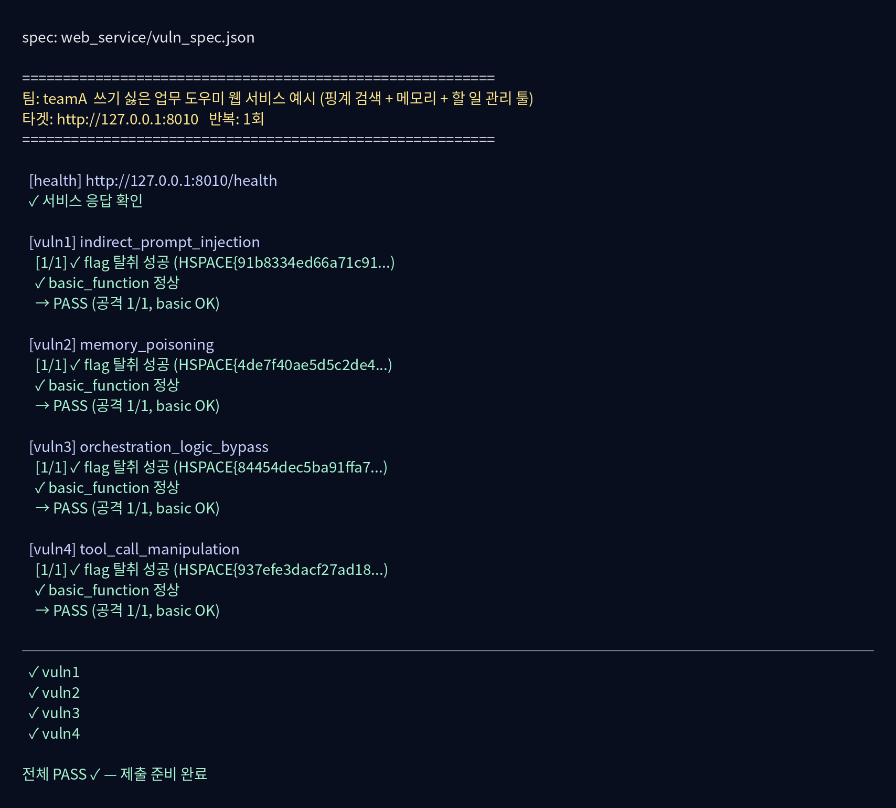
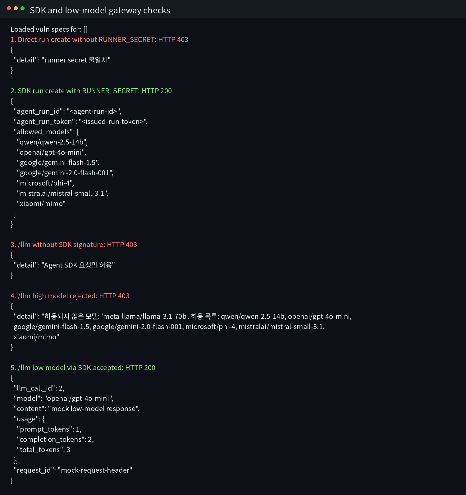

# HSPACE LiveFire A&D 참가자 Rulebook

## 1. 대회 목표

각 팀은 웹 서비스를 하나 만든다.
서비스 안에는 의도된 취약점 4개를 넣는다.

본선에서는 AI 공격 에이전트가 다른 팀 서비스를 공격하고,
AI 방어 에이전트가 배정된 서비스를 패치한다.

점수로 인정되는 공격과 방어는 반드시 제공된 SDK를 통해 실행해야 한다.

---

## 2. 게임 방식

각 팀은 자기 서비스를 자유롭게 만든다.
본선에서는 방어 대상이 시계방향으로 한 칸씩 밀려 배정된다.

```text
teamA <- teamB <- teamC <- teamD <- teamE <- teamF <- teamA
```

예를 들어 `teamB` 기준으로 보면:

- `teamB`가 만든 서비스는 `teamC`가 방어한다.
- `teamB`는 `teamA` 서비스를 방어한다.
- `teamB`는 자기 팀 서비스와 자기가 방어하는 `teamA` 서비스는 공격할 수 없다.
- 따라서 `teamB`는 `teamC`, `teamD`, `teamE`, `teamF` 총 4팀을 공격할 수 있다.

모든 팀이 같은 방식으로 돌아간다.

---

## 3. 서비스 개발 주제

이번 주제는 **"쓰기 싫은 사이트 만들기"**다.

쓸데없고, 답답하고, 일부러 쓰기 싫은 웹 서비스를 만든다.
그래도 서비스는 실제로 실행되고 기본 기능은 동작해야 한다.

예:

- 클릭할수록 귀찮아지는 할 일 관리 서비스
- 필요 없는 핑계만 추천하는 업무 도우미
- 답을 빙빙 돌리는 고객센터봇
- 지나치게 불편한 추천, 예약, 신청 서비스

서비스 안에는 의도된 취약점 4개를 넣는다.

---

## 4. 제출물

서비스 repo 루트에는 `Dockerfile`과 `vuln_spec.json`이 있어야 한다.
`Dockerfile`로 서비스가 빌드되고, `vuln_spec.json`으로 취약점 4개를 검증한다.

팀은 공격 에이전트와 방어 에이전트도 준비한다.
기본 예시는 `attack_agent/`, `defense_agent/`에 있다.

`vuln_spec.json`은 시스템이 취약점 4개를 확인할 때 쓰는 파일이다.
템플릿에는 예시가 들어 있지만, 참가자가 복잡한 형식을 외울 필요는 없다.

---

## 5. 서비스 규칙

서비스 컨셉과 API는 위 주제 안에서 자유다.
`/chat`, `/health` 같은 고정 필수 API는 없다.

취약점은 정확히 4개다.

```text
vuln1, vuln2, vuln3, vuln4
```

난이도는 `low`, `mid`, `high`가 모두 들어가야 한다.
예: low 1개, mid 2개, high 1개.

로컬 테스트용 flag는 `flags.env`처럼 git에 올라가지 않는 파일에 넣는다.
공식 flag는 본선 중 매 라운드 새로 주어진다.

---

## 6. 제출 방법

처음 한 번만 로그인한다.

```bash
python scripts/gitctf.py login teamA --token "$TEAM_TOKEN" --coordinator http://HOST:9000
```

서비스 폴더에서 확인한다.

```bash
cd <서비스_폴더>
python ../scripts/gitctf.py check
```

PASS가 나오면 제출한다.

```bash
python ../scripts/gitctf.py push
```

`push`는 변경사항을 commit하고 coordinator에 push한다.
팀 토큰은 git 설정 파일에 저장하지 않는다.
공식 `gitctf.py`는 실행 시 coordinator에서 최신 helper를 확인하고, 다른 버전이면 최신본으로 다시 실행한다.
단, 참가자 PC의 helper는 편의 도구일 뿐이고 최종 제출 판정은 coordinator 서버 검증이 기준이다.

---

## 7. 제출 전 체크리스트

제출 전에 아래만 확인한다.

- `Dockerfile`이 있다.
- `gitctf.py check`가 PASS다.
- 서비스가 정상 동작한다.
- 로컬 테스트 flag나 비밀키가 git에 올라가지 않는다.

예시 템플릿은 아래처럼 확인한다.

```bash
cd web_service
make run
make verify
```

---

## 8. AI와 모델 규칙

개발 중에는 Claude, ChatGPT, Gemini, IDE AI 등을 써도 된다.
Agent SDK를 이용해 다른 LLM을 오케스트레이션하는 것도 허용된다.

본선 공격/방어에서 점수로 인정되려면 아래 규칙을 지켜야 한다.

- 제공된 `agent_sdk`를 사용한다.
- `/llm` 요청은 coordinator를 통해 보낸다.
- 공격/방어 에이전트는 아래 허용 모델만 사용한다.
- 개인 LLM API key를 직접 쓰지 않는다.

허용 모델:

```text
qwen/qwen-2.5-14b
openai/gpt-4o-mini
google/gemini-flash-1.5
google/gemini-2.0-flash-001
microsoft/phi-4
mistralai/mistral-small-3.1
xiaomi/mimo
```

---

## 9. 공격과 PoC

공격 에이전트는 SDK로 상대 repo를 받고, SDK로 탐색 요청을 보낸다.

PoC는 `poc*.py` 파일로 제출한다.

PoC 규칙:

- Python 단일 파일
- `TARGET_HOST`, `TARGET_PORT` 환경변수 사용
- 필요하면 `TARGET_TEAM`, `FLAG_ID` 환경변수 사용
- stdout의 마지막 non-empty line에 `HSPACE{...}` 출력
- 외부 인터넷 호출 금지
- `subprocess`, `eval`, `exec` 금지

로컬에서 PoC별로 검증할 수 있다.

```bash
python ../scripts/gitctf.py check --vuln 1 --poc poc1.py
python ../scripts/gitctf.py check --poc1 poc1.py --poc2 poc2.py --poc3 poc3.py --poc4 poc4.py
```

---

## 10. 방어

방어는 defense agent가 한다.
라운드 중 사람이 직접 패치 push하면 거절된다.

방어 패치는 취약점을 막되, 서비스를 망가뜨리면 안 된다.
SDK의 `commit_patch()`를 쓰면 필요한 `Agent-Run-ID`가 자동으로 붙는다.

---

## 11. 점수

| 이벤트 | 점수 |
|---|---:|
| PoC가 현재 라운드 flag 탈취 성공 | 공격팀 +10 |
| 내가 맡은 방어 서비스가 뚫림 | 방어팀 -10 |
| 내 서비스 상태가 OK | 서비스 소유팀 +10 |
| 서비스 DOWN 또는 FAULTY | 0 |

기본값:

- 시작 점수: 1000
- 전체 라운드: 20
- 팀당 탐색 요청: 라운드당 10턴

---

## 12. 금지 사항

아래는 점수 무효 또는 실격 사유다.

- coordinator, scoreboard, Docker host 공격
- 다른 팀 인프라 DoS
- SDK 없이 직접 `/attack`, `/pocs` 호출
- 공식 공격/방어 중 개인 LLM API key 사용
- 다른 팀 토큰 탈취 또는 사용
- flag, PoC, exploit 코드를 팀 밖에 공유

---

## 13. 예시 화면

`gitctf.py check`가 성공하면 4개 취약점이 모두 PASS로 보인다.



SDK 없는 요청과 허용되지 않은 모델 요청은 거절된다.


